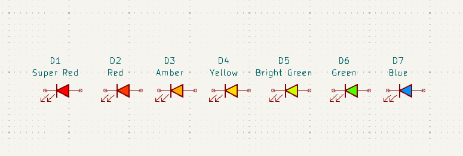
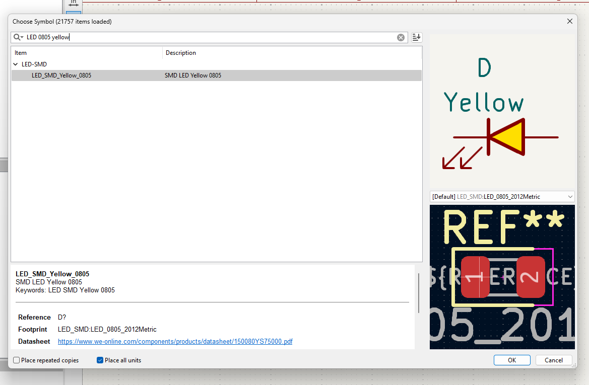

# simple-led-library
A simple to use kicad library for signal LEDs 

### Motivation

KiCad does not ship atomic parts for signal LEDs (symbols with pre-assigned footprints and parameters). Thus, users have to do it themselves, this is time-consuming and frustrating. To save time for myself and others, I have created this custom KiCad library designed to augment the default library and simplify the process of adding signal LEDs to your project. 

### Features
* LEDs can easily be found by entering the color and footprint into the search bar of the KiCad part picker.
* All parameters, including footprint and Manufacturer Part Number (MPN), are pre-set.
* The symbol body displays the corresponding LED color, making it visually appealing.
* The `value` field only documents the color and not the long and complex part number.
* The MPN selection is transparent to the user. The part number of the corresponding LED is documented in the MPN field.
* I chose LEDs from the WL-SMCW series by Würth Elektronik with waterclear lense for this library.

### Usage

LEDs can be searched by entering `LED + [color] + [footprint]` in the part picker search bar. 

| Colour        | Footprint        |
| ------------- | ------------- |
| Amber      |   0603      |
| Blue      |  0805      |
| Bright Green | 1206 |
|Green | 
|Red | 
|Yellow | 
|Super Red | 

